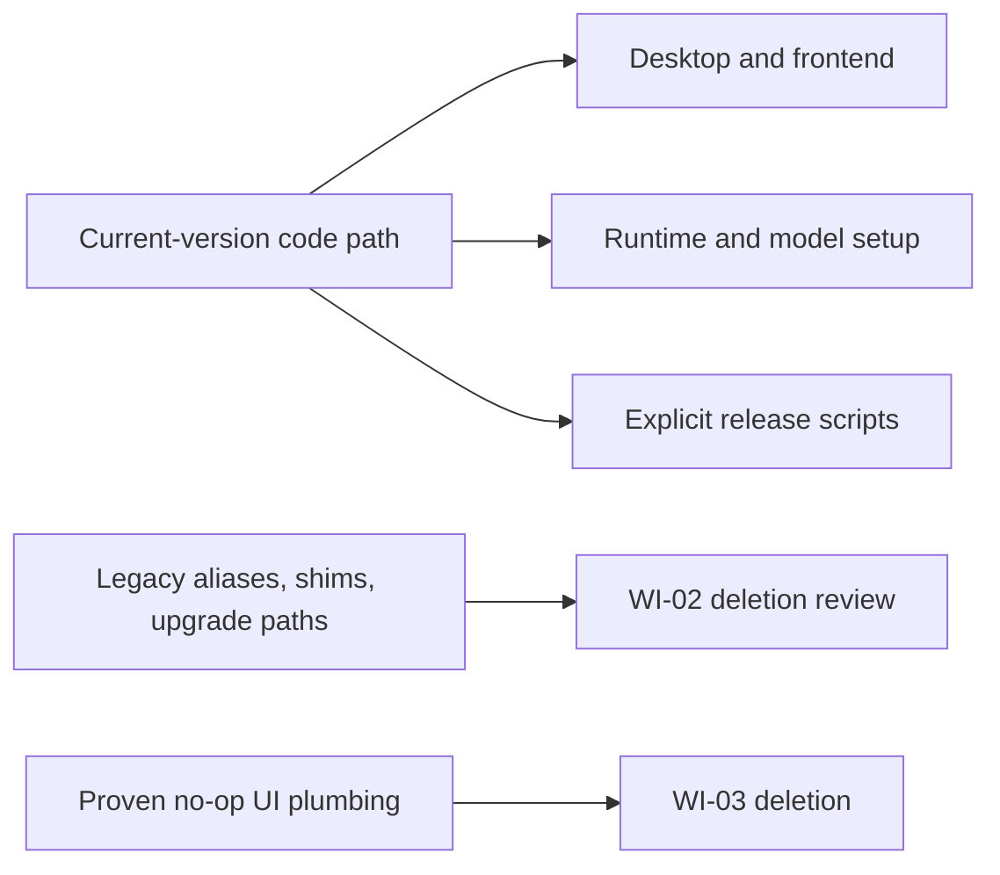

# ShotSieve maintainability, architecture, and technical-debt audit

**Audit date:** 2026-09-18  
**Scope:** The initial audit was read-only. WI-01, WI-02, and WI-03 were subsequently implemented and verified; this document now records both the original evidence and the lean follow-up policy. Line references are 1-indexed and reflect the audited checkout unless noted otherwise.

## Solo-development policy

ShotSieve is a single-user desktop application maintained by one developer.
New versions are distributed as fresh downloads; upgrade, migration, and
external-integration compatibility are not product requirements. This policy
supersedes any contrary recommendation in the historical audit detail below.

- Prefer deleting old branches, aliases, shims, and test scaffolding over
  preserving upgrade paths.
- Prefer one direct call or explicit duplicated release command over a new
  registry, plan emitter, factory, callback layer, or framework.
- Preserve protections for the *current run*: user-photo deletion guards,
  atomic writes required for an interrupted first install, database closure,
  bounded decoding, and cancellation truthfulness are still non-negotiable.
- Do not add recovery for a previous version. A broken or abandoned runtime
  should be fixed by a fresh download/reinstall, not by retained-version
  fallback machinery.
- The work-item register is the only actionable roadmap. Sections A–K retain
  source evidence, but their former priority/order must not create work that
  is absent from the register.

## Work-item register

Use this register to plan follow-up sessions. Items are intentionally bounded
to reduce code and maintenance burden. Do not merge items that cross their
listed rollback boundary.

| ID | Status | Priority | Work item | Scope and acceptance criteria | Suggested verification |
|---|---|---|---|---|---|
| **WI-01** | **Completed — retain** | P1 | **Direct correctness fixes** | Bare SQLite migration rows, worker-start lock release, composed **Open original**, reset profile detail, and two documentation corrections. No new reusable production abstraction was introduced. | Completed: 718 passed, 1 skipped; Ruff passed. |
| **WI-02** | **Completed — retain** | P2 | **Delete version-compatibility code** | Remove only code that supports an old install, old target/launcher ID, old sidecar location/marker, old preview name, old model alias, or old public/private helper name. Make current-version direct paths the only path. Do not add replacement adapters. | Completed: 710 passed, 1 skipped; Ruff passed. Type tools unavailable. |
| **WI-03** | **Completed - retain** | P3 | **Delete proven frontend no-ops** | Remove no-op `addLogEntry`, unused score-card/status-pill hooks, and the unused score-sort hook. Keep the now-working direct Open-original callback. Do **not** add module registries or startup validation frameworks. | Completed: 157 frontend/static/accessibility/responsive tests; 57 browser tests passed with one transient shell-ready timeout whose isolated rerun passed; Ruff passed; full pytest 711 passed, 1 skipped. Type tools unavailable. |
| **WI-04** | **Completed - retain** | P3 | **Remove legacy signature fallback dispatch** | Replace `inspect.signature` compatibility forwarding for `max_decode_pixels` with direct current signatures, then delete the unused fallback branches and imports. Do not introduce a generic callback helper. | Completed: baseline scanner/preview/scoring/runtime-helper set 101 passed; expanded focused set 225 passed; final runtime-focused check 30 passed; Ruff passed; full pytest 711 passed, 1 skipped in 233.85s. Type tools unavailable. |
| **WI-05** | **Completed — retain** | P4 | **Simplify runtime-asset publication after first-install evidence** | Extract runtime archives on the destination volume, validate the launcher before publication, and write the checksum marker in staging. Do not add previous-version backup/restore or upgrade recovery. | Completed: reproducible fresh-install invalid-layout case; focused baseline 70 passed, post-change 71 passed; Ruff passed; full pytest 712 passed, 1 skipped. Type tools unavailable. |
| **WI-06** | Rejected | — | **Central target-install plan emitter** | Keep the existing explicit Python, PowerShell, and Actions install commands. A shared plan parser/emitter would add more code and shell failure modes than it removes for one maintainer. | None. Update the few explicit commands together when pins change. |
| **WI-07** | Rejected | — | **Release-asset preservation flag** | Keep intentional source-archive deletion in release-only tooling. Local release inputs are disposable and a fresh build/download is the recovery path. Do not add a flag, confirmation protocol, or retained-artifact policy. | Existing release-script tests. |
| **WI-08** | Rejected | — | **Module registry and extra partial-result UX** | Classic script ordering is adequate for a single app shell. The current missing-cache behavior is truthful enough; do not add registry plumbing or per-root presentation state without a user-visible failure. | None. |

### WI-01 implementation review

**Decision: retain all production changes; no rollback is recommended.**

- `db.py` changed one expression from `row["name"]` to `row[1]`, which works
  for both the existing `sqlite3.Row` connection and a bare SQLite connection.
  It reduces an implicit requirement rather than adding a compatibility layer.
- The three worker-start fixes are direct four-line guards. They prevent the
  single process from becoming permanently unavailable after a rare thread
  creation failure; no lifecycle abstraction was introduced.
- The Open-original fix is one late-bound callback and a browser regression.
  It fixes a visible no-op without altering the endpoint or adding a module
  system. The closure is safe because it runs after workflow composition.
- Passing `updateResourceProfileDetail` is one explicit dependency that fixes
  a stale Settings display. Replacing it with event redispatching would be
  less direct and would alter persistence side effects.
- The added tests are specific regression coverage. Their minor duplication
  and the private `_open_review_tab` import are acceptable test-only costs;
  do not create a shared test framework to remove them.

The only follow-up note is stylistic: `workflowsHolder` is declared after the
callback that closes over it. JavaScript's closure semantics make this safe,
and moving the declaration would provide no material benefit. Leave it alone.

### WI-02 implementation review

**Decision: retain the current-version direct paths; no rollback is recommended.**

- Release target and launcher handling now accepts only the explicit current
  target IDs. Old target aliases, manifest aliases, and old sidecar locations or
  state markers are no longer resolved.
- `desktop.py` and `bootstrap_sidecar.py` import runtime helpers directly.
  `bootstrap.py` no longer re-exports the sidecar API, and the shared runtime
  façade plus its seam-only tests were removed.
- Preview-name candidates, stale-preview cleanup fallback, the old preview
  conversion wrapper, the `MAX_DECODE_PIXELS` alias, retired learned-model
  aliases, and the CUDA bootstrap alias were removed. Current preview-root,
  atomic sidecar, path, bounded-decoding, and database safeguards remain.
- The frontend marker function was removed after replacing its source-string
  assertion with a browser behavioral test for database-scoped UI state.

Focused verification was run before and after each behavior batch: the baseline
compatibility set passed **145 tests**; target/sidecar tests passed **97**;
model-catalog tests passed **112**; preview/cache/media tests passed **205**;
decode/cleanup tests passed **28**; direct-facade tests passed **104**; the
frontend/static batch passed **102**; and the final media-focused check passed
**8 tests**. The first full run identified two obsolete preview-name tests;
those tests were removed with the retired behavior, then the focused media check
passed. The final explicit-launcher parsing check passed **74 tests**.

Final verification: `python -m ruff check src tests` passed; the full
`python -m pytest -q --basetemp .pytest-tmp-wi02-full3` suite passed **710
tests**, with **1 skipped**, in **232.44s**. Type verification was not run
because neither `mypy` nor `pyright` is installed and no type-check command is
configured.

### WI-03 implementation review

**Decision: retain the direct frontend composition; no rollback is recommended.**

- Removed the no-op `addLogEntry` function, every production call and
  dependency injection, and the log-only export metadata. Real `showToast`
  notifications, busy-state messages, cancellation handling, and error paths
  remain in place.
- Removed the unused `scoreCard` and `statusPill` controller factories and
  grid/review forwarding. Review still renders its active detail score and
  metadata directly, including the working composed Open-original callback.
- Removed the unused `getSortRelevantScore` function, public export, and
  app/grid forwarding. The actual server-backed sort and queue score display
  paths remain unchanged. No registry, startup validator, or replacement
  abstraction was introduced.
- Added a static regression asserting that the four deleted hook names are
  absent from the shipped combined frontend JavaScript, and removed stale
  no-op notification fixtures from frontend tests.

Focused verification before behavior changes: the baseline frontend/static,
accessibility, and responsive batch passed **156 tests**. After each deletion
batch, the focused workflow/static batch passed **121 tests**; the new static
dead-hook assertion passed **1 test**. The final frontend/static/accessibility/
responsive batch passed **157 tests**. The explicit browser-marked suite passed
**57 tests** with one transient shell-readiness timeout; rerunning the exact
affected test passed **1 test**.

Final verification: `python -m ruff check src tests` passed; the full
`python -m pytest -q --basetemp .pytest-tmp-wi03-full` suite passed **711
tests**, with **1 skipped**, in **237.12s**. Type verification was not run
because neither `mypy` nor `pyright` is installed and no type-check command is
configured.

### WI-04 implementation review

**Decision: retain the direct current-version calls; no rollback is recommended.**

- Scanner and preview now call the current preview signatures directly, including
  `max_decode_pixels` for both single-file and pooled generation.
- Scoring now forwards the decode budget directly to the current backend and
  preview interfaces. The repeated backend call remains a small domain-specific
  wrapper; no generic callback helper was introduced.
- Learned-IQA batch and single-image loading now receive the current decode
  budget signature directly. A missing optional budget still resolves to the
  existing default budget, preserving the current public behavior without
  probing a callable's signature.
- Removed the signature-probing paths, the unused `inspect`
  imports, the scanner compatibility wrapper, and the backend keyword-probe
  helper. Updated test doubles to implement the current internal signatures.

Focused verification before behavior changes: the scanner, preview, scoring,
and runtime-helper baseline passed **101 tests** using a workspace-local
pytest basetemp because the host temp root denied enumeration. After the
production deletion and test-double updates, the expanded scanner/preview/
scoring/comparison/runtime/helper/media/model/review/job batch passed
**225 tests**. Final verification: `python -m ruff check src tests` passed;
the full `python -m pytest -q --basetemp .pytest-tmp-wi04-full-final` suite passed
**711 tests**, with **1 skipped**, in **233.85s**. Type verification was not
run because neither `mypy` nor `pyright` is installed and no type-check
command is configured in `pyproject.toml`.

### WI-05 implementation review

**Decision: retain the direct fresh-install publication fix; no upgrade recovery was added.**

- A checksum-valid archive with the expected launcher missing reproduced the
  first-install failure: the old code moved the invalid extraction into
  `installs/<target>`, wrote `.asset-sha256`, and only then raised the missing
  executable error.
- Runtime archives now extract into a temporary directory under the destination
  `installs` directory, validate the expected launcher while still staged, and
  write the checksum marker before moving the staged directory into place. An
  invalid fresh archive therefore leaves no published target install.
- No previous-version backup, restore, or compatibility path was introduced.

Focused verification before the behavior change passed **70 tests**. The
focused runtime/bootstrap/release set after the change passed **71 tests**,
including the reproduced invalid-layout regression. `python -m ruff check src
tests` passed. The full `python -m pytest -q --basetemp .pytest-tmp-wi05-full`
suite passed **712 tests**, with **1 skipped**, in **231.72s**. Type verification
was not run because neither `mypy` nor `pyright` is installed and no type-check
command is configured in `pyproject.toml`.

### New-session starter prompt

> Continue ShotSieve cleanup using `report.md` as the source of truth. WI-01 through WI-05 are complete and retained. Do not add upgrade recovery or compatibility helpers without a newly recorded work item.

### WI-01 completion notes

- Implemented the four bounded behavior fixes and the README/AMD ROCm
  documentation corrections. WI-04 through WI-08 remain unchanged.
- Added regressions for bare SQLite migration connections, scan/score/compare
  worker-start lock release, the composed Review “Open File” request, and
  full-reset resource-profile detail refresh.
- Focused verification before final-suite verification: the schema/path suite
  passed **12 tests**; the operation-job suite passed **9 tests**; the
  frontend state-reset plus static-asset suites passed **102 tests**.
- Final verification: `python -m ruff check src tests` passed; the full
  `python -m pytest -q` suite passed **718 tests**, with **1 skipped**, in
  **245.09s**. The suite used a workspace-local pytest basetemp because the
  host temp root denied enumeration to pytest.
- Type verification was not run because neither `mypy` nor `pyright` is
  installed and no type-check command is configured in `pyproject.toml`.

## A. Executive summary

ShotSieve is in good shape for a single-user desktop application following a
substantial 0.4.x runtime, safety, and frontend-workflow refactor. The
important design decisions are generally explicit: destructive file operations
preserve per-file state; scans are deterministic and retain diagnostics; and
optional ML probes fail safely.

WI-01 resolved the three concrete current-version defects found in the initial
audit. The remaining maintainability goal is to remove old-version support and
proven no-op code—not to add resilience for upgrades, generalized metadata
systems, or more frontend infrastructure.

| Dimension | Score | Rationale |
|---|---:|---|
| Architecture | **7.5/10** | Clear subsystem boundaries and recent focused decompositions; compatibility facades and dynamic callback maps add understandable but real coupling. |
| Maintainability | **7/10** | Most large modules are cohesive, but a few intentionally retained facades and duplicated release-install rules increase change cost. |
| Testability | **8/10** | 712 passing tests cover edge cases, recovery, browser behavior, and release scripting. Missing regressions are narrow and identifiable. |
| Reliability | **7.5/10** | File-operation, scan, sidecar, and model-readiness recovery are unusually careful. Archive publication and rare worker-start failures need hardening. |
| Portability | **7/10** | CPU, CUDA, ROCm, XPU, and MPS are modeled distinctly with platform-specific constraints. Actual accelerator evidence is outside generic CI. |
| Release engineering | **7/10** | Matrix-driven archive metadata, checksums, split assets, and torchless validation are strong; duplicated package-install commands and a destructive helper contract remain risks. |

### Evidence collected

- `python -m ruff check src tests` passed after WI-01 on Windows with Python 3.14.5.
- `python -m pytest -q` passed after WI-01: **718 passed, 1 skipped in 245.09s**.
- A direct bare-connection probe reproduced the prior `apply_schema_migrations()` failure; WI-01 corrected it with positional `PRAGMA` row access.
- The current PyTorch XPU and AMD ROCm compatibility pages were checked. They support the repository's qualified hardware/OS/driver wording; they do **not** establish that ShotSieve has run on every packaged target.

## Architecture and execution flows

### Runtime/bootstrap lifecycle

The design has two related paths that should stay distinct:

1. **Archive bootstrap:** `bootstrap.py` resolves a runtime asset, verifies a manifest/archive SHA-256, extracts it, then launches the chosen executable. Its automatic selector intentionally chooses only NVIDIA CUDA versus CPU on Windows/Linux and Apple MPS versus CPU on macOS (`src/shotsieve/bootstrap_assets.py:67-83`); XPU and ROCm are selected by their explicit packaged launcher/target rather than speculative vendor detection.
2. **Desktop sidecar preparation:** the frozen target executable enters `desktop.main()` (`src/shotsieve/desktop.py:607-645`), derives a canonical target from its launcher name (`58-95`), prepares a target-specific Torch sidecar, probes it, then optionally prepares learned-IQA packages and starts the local web UI.

| Runtime | Target selection and constraints | Installation, validation, and fallback |
|---|---|---|
| CPU | `release_targets.py:66-82` and `126-142` define Windows/Linux CPU targets; macOS CPU is at `186-202`. `bootstrap_sidecar.torch_install_plan()` uses the PyTorch CPU index on Windows/Linux and default packages on macOS (`295-347`). | Sidecar state requires Torch plus a plan fingerprint (`384-406`). If setup is declined/offline/fails, Catalog and Review still start without learned models (`desktop.py:475-572`). |
| NVIDIA CUDA | Explicit `*-nvidia-cuda` target IDs (`release_targets.py:81-97`, `171-187`) map to the cu130 index in `dependency_constraints.py:28-30` and `bootstrap_sidecar.py:310-313`. | `learned_iqa_runtime.cuda_runtime_status()` checks driver availability, excludes HIP, and verifies compiled GPU architectures before use (`192-237`). Auto mode falls back to CPU; an explicit unavailable CUDA request raises a controlled error (`279-365`). |
| AMD ROCm | Explicit `*-amd-rocm` targets select Linux or Windows direct AMD package URLs (`bootstrap_sidecar.py:321-329`; source data in `dependency_constraints.py:62-86`). Their release targets intentionally use Python 3.12 (`104-120`, `156-172`). | A HIP build is classified as logical `rocm`, even though PyTorch uses the CUDA device API (`learned_iqa_runtime.py:245-252`, `279-307`). Unsupported/unavailable Auto mode continues on CPU; explicit ROCm does not silently become CUDA. |
| Intel XPU | Explicit `*-intel-xpu` targets use the XPU index and `+xpu` pair (`dependency_constraints.py:31-38`, `bootstrap_sidecar.py:314-320`). | `has_xpu()` treats any failed availability probe as unavailable (`255-260`); `resolve_device()` uses `torch.device("xpu")` only after that probe (`323-336`). Auto mode continues to CPU. |
| Apple MPS | The bootstrap selector offers MPS only on Darwin arm64/aarch64 (`bootstrap_assets.py:78-82`); `macos-apple-mps` is a separate target (`201-217`). Default Torch packages are used rather than a CPU/XPU/CUDA index. | `has_mps()` probes `torch.backends.mps` safely (`263-269`). Auto selection on Darwin is MPS then CPU (`109-113`); explicit MPS remains an error if unavailable. |

The shared sidecar lifecycle is sound and should remain intact:

- `TorchInstallPlan` hashes its package/index source contract (`bootstrap_sidecar.py:88-120`).
- The sidecar uses an exclusive lock, staging directory, durable JSON completion marker, and final-directory publication (`410-452`, `619-806`, `1124-1172`).
- Desktop prep adds the sidecar to both `PYTHONPATH` and `sys.path`, clears stale module caches, invalidates hardware-cache state, and re-probes imports (`desktop.py:107-227`, `311-342`, `371-572`).
- `model_assets.py` separates durable readiness records, cache location handling, diagnostics, storage checks, model construction, tiny inference validation, cancellation, and backend release (`62-1013`).

### Workflow boundaries

- **Scan:** `scanner.scan_root()` owns discovery, process-pool lifecycle, batching, cancellation accounting, and durable failure diagnostics (`275-1119`). `web_route_scan.py` owns immutable async request snapshots, per-root transactions, pagination across roots, and job finalization (`20-506`).
- **Preview and score:** one conversion policy in `image_conversion.py:18-173` protects both preview and model inputs. `scoring.py` handles row planning, preview generation/persistence, score persistence, and model comparison.
- **Review/export:** `review_filters.py` holds normalized query predicates; `review.py` is the query/state facade; `review_cache.py` owns cache/deletion safety; `export.py` owns copy/move plus catalog compensation.
- **HTTP/jobs:** `web.py` owns server construction and the legacy dependency container. `web_route_common.py` projects it into narrower route-family views. `web_route_jobs.py`, `web_route_files.py`, `web_route_review.py`, and `web_route_scan.py` then own their family-specific orchestration.
- **Frontend:** `app-workflows.js` is composition-only as documented in `docs/frontend-workflows.md`; polling, operation results, comparison, export, library operations, analysis, and folder browsing are separated into dedicated factories.

## B. Original findings and disposition

This section preserves the original evidence. The work-item register controls
current priority and supersedes the original recommendation where necessary.

### Resolved in WI-01 — `apply_schema_migrations()` bare-connection support

**Evidence:** `src/shotsieve/db.py:192-199` accepts `sqlite3.Connection` but indexes `PRAGMA table_info` rows with `row["name"]`. Bare SQLite connections return tuples unless a row factory is configured. A direct reproduction fails before any migration is applied. The normal product path hides the defect because `connect()` sets `sqlite3.Row` (`src/shotsieve/db.py:50-58`).

**Concrete problem:** integrations, scripts, or future tests calling this public helper with the standard `sqlite3.connect()` API fail with `TypeError`. This is especially hazardous for idempotent migration or repair tooling.

**Small fix:** use a tiny row-name accessor that supports both `sqlite3.Row` and tuple rows, or use positional `PRAGMA table_info` column index 1 inside this helper. Do not alter the normal connection factory or migration semantics.

**What becomes easier:** low-level migrations can be safely reused in diagnostic/repair tools and tests.

**Risk and rollback:** very low; the change is local to column-name extraction. Roll back one helper/test commit if any migration behavior changes.

**Protective tests:** extend `tests/test_schema_and_path_policy.py` with a bare connection containing legacy `files`, `scores`, and `scan_runs` tables; run the helper twice and assert required columns exist both times. The current test at `45-64` exercises the product initializer but not the generic helper.

### Completed in WI-05 — Runtime archive publication safety

**Evidence:** A checksum-valid archive containing only `readme.txt` reproduced a
fresh-install failure: `ensure_runtime_asset()` published the extracted tree and
`.asset-sha256` before `_find_runtime_executable()` reported the missing
launcher. The regression is covered by
`tests/test_bootstrap_runtime_assets.py`.

**Fix:** `ensure_runtime_asset()` stages under `runtime_root / "installs"`,
validates the expected executable before publication, and writes the digest
marker in staging. A malformed fresh-install archive is rejected without
creating `installs/<target>`. Previous-version backup/restore and upgrade
recovery remain intentionally out of scope.

**Verification:** The pre-change focused set passed 70 tests; the post-change
set passed 71; Ruff passed; and the full suite passed 712 tests with 1 skip.

### Resolved in WI-01 — The composed **Open original** action

**Evidence:** `src/shotsieve/static/app.js:133-145` creates the grid before workflow composition and supplies `openOriginalFile: async () => {}`. `src/shotsieve/static/app-review.js:333-347` sees that function, prevents normal link navigation, and calls it. The actual workflow implementation does correctly post to `/api/files/open` in `app-workflow-library-browser.js`.

**Concrete problem:** clicking the visible control in the real application does nothing rather than revealing the source file in the system file manager.

**Small fix:** declare the workflow holder before grid creation and inject a late-bound proxy such as “call `workflowsHolder.openOriginalFile` when available”; alternatively add a narrowly scoped grid setter immediately after workflow composition. Do not change the route or file-manager behavior.

**What becomes easier:** grid construction can remain independent of workflow construction without capturing stale placeholders.

**Risk and rollback:** low. Keep the existing `openOriginalFile` function and endpoint unchanged; revert the one wiring change if initialization order proves problematic.

**Protective tests:** `tests/test_frontend_state_reset.py:34-184` invokes `openOriginalFile` on an independently constructed workflow, and `tests/test_web_static_assets.py:997-1005` checks source strings. Add a browser test against the fully booted app that clicks `#open-original` and verifies the `/api/files/open` request (or a mocked successful reveal endpoint) occurs.

### Resolved in WI-01 — Direct job-starter lock release

**Evidence:** `start_scan_job()` acquires the global lock then calls `thread_factory(...).start()` without a cleanup guard (`src/shotsieve/web_route_jobs.py:407-431`). The same pattern appears in `start_score_job()` (`434-505`, start at `504`) and `start_compare_job()` (`616-679`, start at `678`). In contrast, `_start_operation_job()` releases the lock when start fails (`250-305`).

**Concrete problem:** a thread-factory/start failure produces an HTTP error but leaves `operation_lock` locked. All subsequent mutations return conflict until process restart.

**Small fix:** wrap each direct `start()` call in `try/except`, release the lock, then re-raise. Prefer a tiny shared “start worker or release lock” helper only if it removes the three identical guards without absorbing job-specific logic.

**What becomes easier:** injected executors and rare OS thread failures preserve the server's liveness guarantee.

**Risk and rollback:** low. Avoid changing job status semantics for threads that successfully start.

**Protective tests:** `tests/test_web_route_operation_jobs.py:20-85` verifies lock release for `_start_operation_job()` only. Add one parametrized test for scan, score, and compare with a `thread_factory` whose `start()` raises; assert the operation lock is available after the exception.

## C. Superseded cleanup proposals

The following historical proposals are retained for traceability only. WI-06
and WI-07 reject their proposed new configuration/confirmation machinery; do
not implement them under the current deployment policy.

### Rejected (WI-06) — Make target-specific Torch installation a single consumable plan

**Evidence of duplication:**

- `dependency_constraints.py:28-86` owns CPU/CUDA/XPU indexes and exact ROCm URLs.
- `bootstrap_sidecar.torch_install_plan()` consumes those values (`src/shotsieve/bootstrap_sidecar.py:295-347`).
- `.github/workflows/release.yml:168-223` repeats all indexes and both ROCm URL lists.
- `scripts/build_windows_releases.ps1:27-45` repeats Windows aliases, and `219-274` repeats CPU/CUDA/XPU indexes plus Windows ROCm URLs.
- `model-smoke.yml:31-37` independently repeats the CPU install recipe.

**Solo-maintainer decision:** keep these explicit commands. The release paths are
few, vendor-specific, and easy to inspect in place; an emitted-plan format,
parser, and cross-shell argument adapter would cost more to maintain than the
duplicated URL lines. When a pin changes, update the explicit source values and
run the existing release tests.

### Remove verified frontend no-op plumbing after fixing the live callback

**Evidence:**

- `addLogEntry()` in `app.js:109-112` intentionally discards both arguments but is injected into every workflow and busy controller.
- `scoreCard` and `statusPill` are defined in `app-controller.js:37-57`, but the grid receives no-op replacements (`app.js:139-140`) and `app-review.js:305-306` explicitly marks them unused.
- `getSortRelevantScore()` is passed through the grid but ignored in `app-review.js:164-173`.

These are not unused imports; they are reachable no-op code. They inflate the frontend dependency object and obscure the one placeholder that caused the Open-original regression.

**Recommendation:** after the P1 callback wiring test exists, remove the no-op `addLogEntry` call chain, dead score-card/status-pill hooks, and unused score-sort hook in one focused frontend cleanup. Do not remove `_testContractMarkers()` in `app.js:299-303` without first replacing its source-level test contract; it is a test-only compatibility marker, not a product feature.

**Benefit:** smaller dependency injection surface and fewer lifecycle placeholders to wire incorrectly. **Risk:** low-to-medium because static tests intentionally inspect some implementation boundaries. **Verification:** add behavioral tests first, then update the affected static contract checks in the same change.

### Rejected (WI-07) — Make release-asset source deletion explicit

**Evidence:** `scripts/prepare_release_assets.py:43-76` splits oversized archives into a separate publish tree, then unconditionally deletes the corresponding file under the caller-provided `--source-root` (`source.unlink()` at `74`). `tests/test_release_manifest_and_bundle.py:216-250` deliberately asserts that deletion.

**Solo-maintainer decision:** keep the intentional release-only disk reclamation
and its existing test. Build artifacts are disposable, and adding a flag,
confirmation flow, or retained-artifact policy would make a rarely used script
more complicated without protecting user photos or current application data.

## D. Lower-priority historical ideas

- **Target translation drift:** handle it by deleting legacy IDs in WI-02, not
  by adding a canonical lookup layer.
- **`max_decode_pixels` inspection:** simplify it with direct current-version
  calls in WI-04, not with a shared compatibility helper.
- **Multi-root missing-cache presentation:** reject until an actual user sees a
  confusing result. It affects cache cleanup rather than source photos.
- **Reset profile detail:** completed in WI-01.
- **Workflow module validation:** reject. Ordered classic scripts are adequate
  for a single application shell; no registry or framework is warranted.

## E. Existing safeguards to retain

These areas look complicated because they protect real constraints. Refactoring them now would move risk rather than remove it.

- **`bootstrap_sidecar.py` staged repair and embedded-pip workarounds.** Frozen pip, source-only `openai-clip`, stale import cache removal, Windows DLL constraints, atomic sidecar publication, and per-target fingerprints are specialized recovery logic. Keep its safeguards. Address only the separately identified archive-publication path and consider a small embedded-pip extraction after behavior is locked down.
- **Scanner batching and accounting.** `scanner.py:275-1119` already has focused helpers for deterministic discovery, process-pool work, cancellation, and final diagnostics. The partial-result behavior is deliberate: `commit_batch()` upserts normalized paths, and cancellation accounts for unattempted paths rather than duplicating catalog rows.
- **File-operation compensation.** `export.py:337-629` and `review_cache.py:608-988` deliberately commit completed per-file changes and reconcile catalog failures before compensation. Do not replace this with a single all-or-nothing transaction; cross-volume move/delete cannot be globally atomic.
- **Model preparation record store.** `model_assets.py:660-1013` has already been split into context, record-store, storage, backend, validation, cancellation, and failure phases. A further module split would create more cross-module state-machine coupling.
- **Broad exception handling in optional-runtime probes.** The catches in `learned_iqa_runtime.py:192-820` and model discovery prevent a broken CUDA/XPU/MPS/ROCm/optional package probe from making `/api/options` fail. Narrowing them without hardware-specific evidence would reduce reliability.
- **Route adapters and dependency views.** The legacy `WebRouteDependencies` container is large, but `WebRouteDependencyView` restricts each family (`web_route_common.py:143-267`) and adapter callbacks preserve documented monkeypatch/integration seams without an import cycle. Do not remove it as a cosmetic cleanup.
- **Frontend workflow split and plain JavaScript.** `app-workflows.js` is composition-only, and the domain modules own their behavior. The current approach is appropriate for the application’s size; no framework migration is justified.
- **Large CSS files.** The four stylesheets have a practical base/layout/workstation/polish load order. No evidence established unused selectors or harmful override conflicts, so selector deletion should not be guessed from static inspection.

## F. Large-file report

Only four files in `src/` exceed 1,000 lines when counted with `Path.read_text().splitlines()` (including blank lines). Size alone is not a finding.

| File | Exact lines | Approximate responsibility and distinct regions | Size justified? | Natural boundary | Recommendation |
|---|---:|---|---|---|---|
| `src/shotsieve/scoring.py` | **1,342** | Legacy-call adapters and row utilities; score-plan selection; preview preparation/persistence; batch inference; compare-model planning/execution; SQL read/write helpers (`26-1342`). | Mostly. Single-model scoring and compare share conversion, candidate, persistence, diagnostics, and backend-lifetime rules. | Comparison is conceptually separate, but extracting it now would expose many private helpers and duplicate lifecycle code. | **Leave alone.** Revisit only if a third scoring workflow appears; then extract a cohesive comparison service with an explicit candidate/result type. |
| `src/shotsieve/bootstrap_sidecar.py` | **1,227** | Target plan/state/lock (`88-484`); frozen embedded-pip compatibility and Torch setup (`487-830`); learned-IQA repair staging (`833-1172`); environment activation (`1178-1227`). | Yes for now. This is platform/package recovery code with unusual frozen-runtime constraints. | The pip compatibility adapter at `487-616` is self-contained. | **Small extraction** of the embedded-pip adapter only after a behavior-preserving test harness is expanded. Keep plans, markers, locks, and staging together. |
| `src/shotsieve/scanner.py` | **1,155** | Ignore/discovery policy (`57-243`); scan lifecycle/finalization (`275-638`); inline/parallel batch processing (`641-850`); metadata persistence and path safety (`853-1155`). | Yes. Process-pool ordering, preview generation, cancellation, and diagnostics must be coordinated. | Discovery could be a module, but today shares scan-specific errors and preview-root policy. | **Leave alone.** Existing internal helpers are the right current decomposition. |
| `src/shotsieve/model_assets.py` | **1,033** | Cache/readiness identity and atomic record I/O (`62-455`); sanitization/classification (`458-648`); preparation state machine (`660-1013`). | Yes. It is a durable lifecycle, not a mixed utility dump. | Diagnostic helpers and state machine are separable only at a cost to the private record contract. | **Leave alone.** Preserve the current explicit phase boundaries. |

### Other unusually complex files inspected

| File | Lines | Assessment | Recommendation |
|---|---:|---|---|
| `review_cache.py` | 988 | Cache pruning, missing-entry confirmation, source-root guards, and delete reconciliation are all cache/file-lifecycle work. | Leave alone; protect its safety invariants. |
| `styles.css` / `styles-layout.css` / `styles-workstation.css` | 966 / 917 / 761 | Large but stylesheet responsibilities are split already. | Leave alone; no unused-selector claim without runtime coverage. |
| `export.py` | 871 | Copy/move transfer and compensation are cohesive, high-risk behavior. | Leave alone. |
| `learned_iqa_runtime.py` | 871 | Device resolution, conservative probes, resource sizing, and import hygiene form one optional-runtime boundary. | Leave alone. |
| `web_route_jobs.py` | 779 | Job status/result/cancel, shared operation launcher, and scan/score/compare/model starters. | No decomposition now; WI-01 completed the direct lock-start hardening. |
| `review.py` / `web_route_common.py` | 771 / 753 | The former is a facade around review query contracts; the latter centralizes context, selection snapshots, and response helpers. | Leave alone while the recent boundary refactor settles. |
| `app-events.js` / `app-controller.js` | 733 / 718 | One DOM event binder and one UI controller; large dependency surfaces but cohesive roles. | Leave alone; remove no-op injections and add the small reset correction. |
| `preview.py` / `app-workflow-compare.js` | 715 / 710 | Preview supports standard/RAW, capture diagnostics, cache naming, and managed cleanup; comparison owns both presentation and workflow. | Leave alone. |
| `web.py` / `bootstrap_assets.py` / `desktop.py` | 690 / 687 / 649 | Server assembly, archive integrity/acquisition, and desktop runtime activation respectively. | Keep boundaries and explicit current-version code paths; do not add upgrade-recovery or target-lookup layers. |

## G. Dead-code and compatibility inventory

The no-op entries were removed in WI-03. The compatibility entries are
candidates for deletion in WI-02, not reasons to preserve an upgrade path.

### WI-03 no-op inventory

| Candidate | Evidence | Classification and recommendation |
|---|---|---|
| `addLogEntry()` | The former `app.js` function discarded both values; all call sites therefore had no observable effect. | Removed in WI-03, with real toast/error/cancellation paths retained and covered by the frontend/browser batch. |
| `scoreCard` and `statusPill` hooks | The former controller factories were replaced by no-ops in `app.js` and ignored by `app-review.js`. | Removed in WI-03 with the unused controller, grid, and review parameters. |
| `getSortRelevantScore` pipeline | The former function was exported by `app-review.js`, passed through `app-grid.js`, and explicitly unused by queue rendering. | Removed in WI-03 with the public export and forwarding destructures. |

### Compatibility code reviewed for WI-02

- `bootstrap.py` is currently a façade/CLI surface supplying sidecar helpers to `desktop.py:11-17`. In WI-02, first verify that no package entry point needs it, switch the one in-repository importer to its concrete module, then delete its re-export/monkeypatch compatibility surface and obsolete tests.
- `runtime_support.py` and aliases in `desktop.py`/`bootstrap_sidecar.py` exist primarily as late-bound test/integration seams. Replace in-repository callers with direct functions and delete the façade, aliases, and seam-only tests only when no current product caller remains.
- Legacy target aliases, old sidecar candidates/state acceptance, preview-name candidates, `_prepare_standard_preview_image()`, `MAX_DECODE_PIXELS`, legacy preview cleanup fallback, and `maybe_prepare_cuda_torch_runtime()` were removed in small verified groups.
- Retired model aliases were removed from `learned_iqa_catalog.py` and the tests that retained them. No active DirectML implementation was found, so no DirectML compatibility migration was needed.
- `_testContractMarkers()` had no product caller. Its source-string assertion was replaced with a browser behavioral check, and the test-only marker was deleted.
- The bootstrap and runtime-support entries above are now complete: concrete
  modules are used directly, the sidecar exports were removed from
  `bootstrap.py`, and the façade/alias seam tests were deleted.

No unused Python imports were identified by Ruff. No endpoint, environment
variable, configuration field, or release helper was proven dead, so WI-02
should not delete those without an in-repository caller check.

## H. Duplication decisions

The explicit package-install command duplication remains acceptable for a
single maintainer. WI-06 rejects a shared plan emitter; keep the current
commands readable and update them together when pins change.

| Rule or logic | Current locations | Recommended ownership | Action |
|---|---|---|---|
| Release target ID, platform, runtime, launcher/archive names | `release_targets.py`, suffix parsing in desktop/sidecar, alias map in PowerShell | `release_targets.py` | Keep explicit launcher parsing at the edge; add a target lookup for canonical target metadata and have PowerShell query it instead of duplicating aliases. |
| Torch package versions/indexes/AMD URLs | `dependency_constraints.py`, sidecar planner, Actions, PowerShell, CPU smoke | `dependency_constraints.py` + `torch_install_plan()` | Highest-value consolidation: consume an emitted plan in build/CI tooling. |
| Optional `max_decode_pixels` compatibility dispatch | scanner, scoring, preview, learned backend | Current internal signatures in those modules | Completed in WI-04; direct calls now forward the budget without signature probing. |
| Runtime availability and hardware cache | `learned_iqa_runtime.py` and re-exporting façade `learned_iqa.py` | `learned_iqa_runtime.py` | Keep the façade aliases for compatibility. Do not consolidate by removing monkeypatchable exports. |
| File-operation result shape/retry semantics | models, export, review cache, route adapters, frontend operation-result module | `models.FileOperationResult` / `FileOperationSummary` server-side and operation-results JS client-side | Already appropriately centralized at each side of the HTTP boundary. Keep the two representations distinct. |
| Review filters, listing, count, revisions, and selections | `review_filters.py`, `review.py`, web route common/review | `review_filters.py` for predicate construction | Already a good consolidation. Do not reintroduce duplicated route-specific filters. |

## I. Target architecture

No new target architecture is needed. Keep the current direct modules and
explicit scripts. The intended shape is smaller over time:



Keep only the safeguards required for a fresh install and the current running
application. Avoid new intermediary modules, plan generators, registries, and
facades unless a current-version defect cannot be fixed directly.

## J. Lean cleanup sequence

1. **WI-02:** delete old-version compatibility code in small, independently
  testable batches. Prefer deleting its tests rather than retaining a shim.
2. **WI-03:** remove proven frontend no-ops directly; do not replace them with
  logging, registries, or another indirection layer.
3. **WI-04:** completed; retain the direct current-version calls and their
  focused regressions.
4. **WI-05:** completed; retain destination-volume staging and pre-publication
  launcher validation. Do not add previous-version backup/restore.
5. Stop after each item and measure the maintenance benefit. WI-06 through
  WI-08 remain rejected or intentionally parked.

## K. Verification commands

Run these after the corresponding work. On Windows PowerShell, quote extras containing commas.

### Core lint and tests

```powershell
python -m pip install -e ".[test,lint]"
python -m ruff check src tests
python -m pytest -q
python -m pytest -q tests/test_schema_and_path_policy.py tests/test_bootstrap_runtime_assets.py tests/test_web_route_operation_jobs.py
```

### Browser/Playwright coverage

```powershell
python -m playwright install chromium
python -m pytest -q -m browser
python -m pytest -q tests/test_frontend_state_reset.py tests/test_frontend_operation_results.py tests/test_web_static_assets.py
```

### Wheel/package smoke

```powershell
python -m pip install --upgrade build
python -m build --wheel --outdir dist
$wheelVenv = Join-Path $env:TEMP "shotsieve-wheel-smoke"
python -m venv $wheelVenv
& "$wheelVenv\Scripts\python.exe" -m pip install --upgrade pip
& "$wheelVenv\Scripts\python.exe" -m pip install (Get-ChildItem dist\*.whl | Select-Object -First 1).FullName
& "$wheelVenv\Scripts\python.exe" -m pip check
& "$wheelVenv\Scripts\shotsieve-desktop.exe" --help
```

### Release-plan and portable-build validation

```powershell
python scripts/release_target_matrix.py --kind runtime
.\scripts\build_windows_releases.ps1 -Mode runtime -PlanOnly -AsJson
python scripts/build_portable_bundle.py --target windows-cpu --plan
python -m pytest -q tests/test_release_manifest_and_bundle.py tests/test_release_scripts.py tests/test_bootstrap.py tests/test_bootstrap_runtime_assets.py
```

For a real target build, use the declared target interpreter (not the active Python 3.14 development interpreter for targets pinned to 3.12/3.13):

```powershell
.\scripts\build_windows_releases.ps1 -Mode runtime -TargetIds windows-cpu
```

### Hardware and packaged-runtime evidence

CPU has weekly/manual real-model smoke coverage through `.github/workflows/model-smoke.yml`; it runs each supported model online and then in a fresh offline process. CUDA, ROCm, XPU, MPS, and first-run packaged-sidecar installation require target-host evidence in addition to unit mocks and archive `--help` smoke checks.

Use the appropriate guide and retain the generated sanitized report:

```powershell
python scripts/model_smoke.py --help
```

Then follow `docs/intel-xpu.md` or `docs/amd-rocm.md` for a native tensor operation plus online/offline model preparation. For CUDA and MPS, use the same `model_smoke.py` process on supported hardware, record driver/OS/Python/Torch/runtime/model details, and run the actual packaged launcher plus sidecar installation. Mocked availability is not accelerator evidence.

## Final assessment

WI-01 through WI-05 are lean and should remain. Future work should remove
code, not create more recovery or metadata machinery. Preserve current-run
photo, filesystem, database, decoding, and cancellation safeguards; discard
upgrade and compatibility mechanisms that are no longer part of the product
contract.
