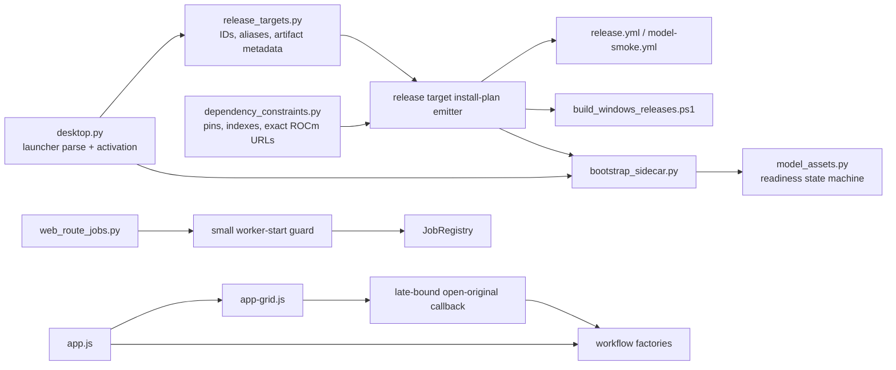

# ShotSieve maintainability, architecture, and technical-debt audit

**Audit date:** 2026-09-18  
**Scope:** Read-only review of all tracked production modules, static frontend, tests, build/release scripts, workflows, and project documentation. Line references are 1-indexed and reflect this checkout. No product behavior was changed.

## Work-item register

Use this register to plan follow-up sessions. Items are intentionally bounded;
the detailed audit sections below are the evidence and design notes for them.
Do not merge items that cross their listed rollback boundary.

| ID | Status | Priority | Work item | Scope and acceptance criteria | Suggested verification |
|---|---|---|---|---|---|
| **WI-01** | **Completed (2026-09-18)** | P1 | **Quick safety and documentation corrections** | Fix bare-connection migration row access; release the operation lock when scan/score/compare worker startup fails; late-bind the grid's **Open original** handler; pass the profile-detail updater to full-reset handling; rename the README 0.4 heading; fix the malformed AMD ROCm bullet. No API or product-workflow redesign. | Focused schema, jobs, and browser tests; Ruff; full pytest. |
| **WI-02** | Proposed | P1 | **Make runtime-asset publication rollback-safe** | Validate the staged runtime executable before replacement; stage on the destination volume; retain/restore the prior install if publication fails; clean retained staging only after a successful publish. Preserve checksums, archive traversal protections, and local fallback behavior. | New bootstrap failure-injection tests; existing bootstrap asset suite; packaged runtime smoke. |
| **WI-03** | Proposed | P2 | **Centralize target-specific Torch install plans** | Keep `release_targets.py` as target/artifact metadata and `dependency_constraints.py` as version/source data. Add a machine-readable existing-plan adapter and migrate PowerShell, Actions, and CPU smoke one consumer at a time. | Plan parity tests for every target; release-script tests; `pip check` for each target environment. |
| **WI-04** | Proposed | P2 | **Make release asset consumption explicit** | Change split-archive source deletion to an explicit opt-in for CI artifact cleanup or visibly document/confirm the destructive behavior. Default local rehearsal behavior must preserve original archives. | `prepare_release_assets` default/opt-in tests; release workflow review. |
| **WI-05** | Proposed | P3 | **Remove proven frontend no-op plumbing and validate module loading** | After WI-01 covers the live callback, remove unused score-card/status-pill/sort-hook injection and no-op logging plumbing. Add a startup check that names a missing mandatory workflow factory. Preserve the stable `ShotSieveWorkflows` API and classic-script delivery. | Composed browser tests; static-asset contract tests; accessibility/browser suite. |
| **WI-06** | Proposed | P3 | **Reduce canonical target translation drift** | Add a canonical `ReleaseTarget` lookup for platform/runtime fields and consume it where a canonical target ID is already available. Retain legacy aliases and launcher-name parsing at external boundaries. | Target/alias parametrization; runtime helper and release-matrix tests. |
| **WI-07** | Deferred | P3 | **Consolidate optional decode-budget signature compatibility** | Consider one tiny helper for the repeated inspect-and-forward `max_decode_pixels` compatibility pattern only if legacy callback signatures remain supported. Do not build a generic callback framework. | Callable-with-keyword, callable-without-keyword, and opaque-callable regressions. |
| **WI-08** | Deferred | P3 | **Improve multi-root missing-cache partial-result presentation** | Report roots already cleaned when a later root requires refresh, then refresh UI state in a `finally` path. Never roll back completed filesystem/catalog cleanup. | First-root-success/second-root-stale frontend integration test. |

### Recommended first follow-up session

Implement **WI-01 only**. It contains small, independent, low-risk changes and
their tests; it must not include runtime archive publication, release plan
consolidation, or broad frontend restructuring. Commit it as separate logical
changes in this order: migration fix, worker-start lock fix, Open-original
wiring, reset/docs correction. Update each work-item status only after its
focused tests pass.

### New-session starter prompt

> Continue ShotSieve cleanup using `report.md` as the source of truth. Implement **WI-01: Quick safety and documentation corrections** only. First read the work-item register and the cited code/tests. Add or strengthen regressions before each behavior change, preserve public APIs and compatibility seams, and do not touch WI-02 through WI-08. Run focused tests after each logical change, then Ruff and the full pytest suite. Update `report.md` statuses/notes with the completed work and exact verification results.

### WI-01 completion notes

- Implemented the four bounded behavior fixes and the README/AMD ROCm
  documentation corrections. WI-02 through WI-08 remain unchanged.
- Added regressions for bare SQLite migration connections, scan/score/compare
  worker-start lock release, the composed Review “Open File” request, and
  full-reset resource-profile detail refresh.
- Focused verification before final-suite verification: the schema/path suite
  passed **12 tests**; the operation-job suite passed **9 tests**; the
  frontend state-reset plus static-asset suites passed **102 tests**.
- Final verification: `python -m ruff check src tests` passed; the full
  `python -m pytest -q` suite passed **718 tests**, with **1 skipped**, in
  **245.09s**. The suite used a workspace-local pytest basetemp because the
  host temp root denied enumeration to pytest.
- Type verification was not run because neither `mypy` nor `pyright` is
  installed and no type-check command is configured in `pyproject.toml`.

## A. Executive summary

ShotSieve is in good shape for a codebase that has just completed a substantial 0.4.x runtime, safety, and frontend-workflow refactor. The important design decisions are generally explicit: destructive file operations preserve per-file state; scans are deterministic and retain diagnostics; optional ML probes fail safely; release target identity is data-driven; and the frontend decomposition preserves a stable public facade without introducing a framework.

The main concern is not broad architectural decay. It is a small set of boundary defects and sources of future drift:

1. A public SQLite migration helper only works with ShotSieve's row-factory connection, despite accepting a generic `sqlite3.Connection`.
2. Runtime-archive publication can remove a working install before validating the extracted replacement and has no restore path.
3. The composed frontend wires the visible **Open original** control to a no-op callback.
4. Three job starters can leave the global operation lock held if thread creation fails.
5. Target-specific Torch installation knowledge is duplicated between the sidecar planner, GitHub Actions, and PowerShell.

| Dimension | Score | Rationale |
|---|---:|---|
| Architecture | **7.5/10** | Clear subsystem boundaries and recent focused decompositions; compatibility facades and dynamic callback maps add understandable but real coupling. |
| Maintainability | **7/10** | Most large modules are cohesive, but a few intentionally retained facades and duplicated release-install rules increase change cost. |
| Testability | **8/10** | 712 passing tests cover edge cases, recovery, browser behavior, and release scripting. Missing regressions are narrow and identifiable. |
| Reliability | **7.5/10** | File-operation, scan, sidecar, and model-readiness recovery are unusually careful. Archive publication and rare worker-start failures need hardening. |
| Portability | **7/10** | CPU, CUDA, ROCm, XPU, and MPS are modeled distinctly with platform-specific constraints. Actual accelerator evidence is outside generic CI. |
| Release engineering | **7/10** | Matrix-driven archive metadata, checksums, split assets, and torchless validation are strong; duplicated package-install commands and a destructive helper contract remain risks. |

### Evidence collected

- `python -m ruff check src tests` passed on Windows with Python 3.14.5.
- `python -m pytest -q` passed: **712 passed, 1 skipped in 236.65s**.
- A direct bare-connection probe reproduced `apply_schema_migrations()` failing with `TypeError: tuple indices must be integers or slices, not str`.
- The current PyTorch XPU and AMD ROCm compatibility pages were checked. They support the repository's qualified hardware/OS/driver wording; they do **not** establish that ShotSieve has run on every packaged target.

## Architecture and execution flows

### Runtime/bootstrap lifecycle

The design has two related paths that should stay distinct:

1. **Archive bootstrap:** `bootstrap.py` resolves a runtime asset, verifies a manifest/archive SHA-256, extracts it, then launches the chosen executable. Its automatic selector intentionally chooses only NVIDIA CUDA versus CPU on Windows/Linux and Apple MPS versus CPU on macOS (`src/shotsieve/bootstrap_assets.py:67-83`); XPU and ROCm are selected by their explicit packaged launcher/target rather than speculative vendor detection.
2. **Desktop sidecar preparation:** the frozen target executable enters `desktop.main()` (`src/shotsieve/desktop.py:607-645`), derives a canonical target from its launcher name (`58-95`), prepares a target-specific Torch sidecar, probes it, then optionally prepares learned-IQA packages and starts the local web UI.

| Runtime | Target selection and constraints | Installation, validation, and fallback |
|---|---|---|
| CPU | `release_targets.py:66-82` and `126-142` define Windows/Linux CPU targets; macOS CPU is at `186-202`. `bootstrap_sidecar.torch_install_plan()` uses the PyTorch CPU index on Windows/Linux and default packages on macOS (`295-347`). | Sidecar state requires Torch plus a plan fingerprint (`384-406`). If setup is declined/offline/fails, Catalog and Review still start without learned models (`desktop.py:475-572`). |
| NVIDIA CUDA | Explicit `*-nvidia-cuda` target IDs (`release_targets.py:81-97`, `171-187`) map to the cu130 index in `dependency_constraints.py:28-30` and `bootstrap_sidecar.py:310-313`. | `learned_iqa_runtime.cuda_runtime_status()` checks driver availability, excludes HIP, and verifies compiled GPU architectures before use (`192-237`). Auto mode falls back to CPU; an explicit unavailable CUDA request raises a controlled error (`279-365`). |
| AMD ROCm | Explicit `*-amd-rocm` targets select Linux or Windows direct AMD package URLs (`bootstrap_sidecar.py:321-329`; source data in `dependency_constraints.py:62-86`). Their release targets intentionally use Python 3.12 (`104-120`, `156-172`). | A HIP build is classified as logical `rocm`, even though PyTorch uses the CUDA device API (`learned_iqa_runtime.py:245-252`, `279-307`). Unsupported/unavailable Auto mode continues on CPU; explicit ROCm does not silently become CUDA. |
| Intel XPU | Explicit `*-intel-xpu` targets use the XPU index and `+xpu` pair (`dependency_constraints.py:31-38`, `bootstrap_sidecar.py:314-320`). | `has_xpu()` treats any failed availability probe as unavailable (`255-260`); `resolve_device()` uses `torch.device("xpu")` only after that probe (`323-336`). Auto mode continues to CPU. |
| Apple MPS | The bootstrap selector offers MPS only on Darwin arm64/aarch64 (`bootstrap_assets.py:78-82`); `macos-apple-mps` is a separate target (`201-217`). Default Torch packages are used rather than a CPU/XPU/CUDA index. | `has_mps()` probes `torch.backends.mps` safely (`263-269`). Auto selection on Darwin is MPS then CPU (`109-113`); explicit MPS remains an error if unavailable. |

The shared sidecar lifecycle is sound and should remain intact:

- `TorchInstallPlan` hashes its package/index source contract (`bootstrap_sidecar.py:88-120`).
- The sidecar uses an exclusive lock, staging directory, durable JSON completion marker, and final-directory publication (`410-452`, `619-806`, `1124-1172`).
- Desktop prep adds the sidecar to both `PYTHONPATH` and `sys.path`, clears stale module caches, invalidates hardware-cache state, and re-probes imports (`desktop.py:107-227`, `311-342`, `371-572`).
- `model_assets.py` separates durable readiness records, cache location handling, diagnostics, storage checks, model construction, tiny inference validation, cancellation, and backend release (`62-1013`).

### Workflow boundaries

- **Scan:** `scanner.scan_root()` owns discovery, process-pool lifecycle, batching, cancellation accounting, and durable failure diagnostics (`275-1119`). `web_route_scan.py` owns immutable async request snapshots, per-root transactions, pagination across roots, and job finalization (`20-506`).
- **Preview and score:** one conversion policy in `image_conversion.py:18-173` protects both preview and model inputs. `scoring.py` handles row planning, preview generation/persistence, score persistence, and model comparison.
- **Review/export:** `review_filters.py` holds normalized query predicates; `review.py` is the query/state facade; `review_cache.py` owns cache/deletion safety; `export.py` owns copy/move plus catalog compensation.
- **HTTP/jobs:** `web.py` owns server construction and the legacy dependency container. `web_route_common.py` projects it into narrower route-family views. `web_route_jobs.py`, `web_route_files.py`, `web_route_review.py`, and `web_route_scan.py` then own their family-specific orchestration.
- **Frontend:** `app-workflows.js` is composition-only as documented in `docs/frontend-workflows.md`; polling, operation results, comparison, export, library operations, analysis, and folder browsing are separated into dedicated factories.

## B. Immediate problems

These are concrete correctness, recoverability, or safety issues. They are not style-only concerns.

### P1 — `apply_schema_migrations()` violates its generic SQLite contract

**Evidence:** `src/shotsieve/db.py:192-199` accepts `sqlite3.Connection` but indexes `PRAGMA table_info` rows with `row["name"]`. Bare SQLite connections return tuples unless a row factory is configured. A direct reproduction fails before any migration is applied. The normal product path hides the defect because `connect()` sets `sqlite3.Row` (`src/shotsieve/db.py:50-58`).

**Concrete problem:** integrations, scripts, or future tests calling this public helper with the standard `sqlite3.connect()` API fail with `TypeError`. This is especially hazardous for idempotent migration or repair tooling.

**Small fix:** use a tiny row-name accessor that supports both `sqlite3.Row` and tuple rows, or use positional `PRAGMA table_info` column index 1 inside this helper. Do not alter the normal connection factory or migration semantics.

**What becomes easier:** low-level migrations can be safely reused in diagnostic/repair tools and tests.

**Risk and rollback:** very low; the change is local to column-name extraction. Roll back one helper/test commit if any migration behavior changes.

**Protective tests:** extend `tests/test_schema_and_path_policy.py` with a bare connection containing legacy `files`, `scores`, and `scan_runs` tables; run the helper twice and assert required columns exist both times. The current test at `45-64` exercises the product initializer but not the generic helper.

### P1 — Runtime archive publication discards a known-good install too early

**Evidence:** `ensure_runtime_asset()` extracts into a temporary directory but does not call `_find_runtime_executable()` until after it removes `install_dir` and moves the extraction (`src/shotsieve/bootstrap_assets.py:623-687`, especially `677-687`). The move is also not a same-directory staged swap with restoration of the previous install.

**Concrete problem:** a checksum-valid archive with a wrong layout/missing executable, a cross-volume move failure, a full disk, or an interruption can remove an existing working runtime before the replacement is known good. The next start may have neither a launchable old runtime nor a valid new one.

**Small fix:** stage under `runtime_root / "installs"` on the destination volume; extract; validate the expected executable in staging; write the marker in staging; rename existing install to a retained previous directory; rename staging into place; restore previous if publication fails; delete previous only after successful validation/publication. Preserve checksum verification and archive-member traversal protections.

**What becomes easier:** forced refresh and release upgrades are retryable without turning a recoverable bad asset into a broken installation.

**Risk and rollback:** medium because Windows directory rename rules and antivirus locks require careful handling. Keep the old behavior behind the same function boundary and add tests for each rename failure before enabling deletion of the previous directory.

**Protective tests:** `tests/test_bootstrap_runtime_assets.py:29-253` already covers digest failures, local archive fallback, split download, and successful extraction. Add (1) malformed-but-correctly-hashed archive layout leaves the old install untouched, (2) simulated publish rename failure restores the old executable, and (3) a successful refresh removes the previous directory.

### P1 — The composed **Open original** action is a no-op

**Evidence:** `src/shotsieve/static/app.js:133-145` creates the grid before workflow composition and supplies `openOriginalFile: async () => {}`. `src/shotsieve/static/app-review.js:333-347` sees that function, prevents normal link navigation, and calls it. The actual workflow implementation does correctly post to `/api/files/open` in `app-workflow-library-browser.js`.

**Concrete problem:** clicking the visible control in the real application does nothing rather than revealing the source file in the system file manager.

**Small fix:** declare the workflow holder before grid creation and inject a late-bound proxy such as “call `workflowsHolder.openOriginalFile` when available”; alternatively add a narrowly scoped grid setter immediately after workflow composition. Do not change the route or file-manager behavior.

**What becomes easier:** grid construction can remain independent of workflow construction without capturing stale placeholders.

**Risk and rollback:** low. Keep the existing `openOriginalFile` function and endpoint unchanged; revert the one wiring change if initialization order proves problematic.

**Protective tests:** `tests/test_frontend_state_reset.py:34-184` invokes `openOriginalFile` on an independently constructed workflow, and `tests/test_web_static_assets.py:997-1005` checks source strings. Add a browser test against the fully booted app that clicks `#open-original` and verifies the `/api/files/open` request (or a mocked successful reveal endpoint) occurs.

### P2 — Direct scan, score, and compare starters can permanently retain the operation lock

**Evidence:** `start_scan_job()` acquires the global lock then calls `thread_factory(...).start()` without a cleanup guard (`src/shotsieve/web_route_jobs.py:407-431`). The same pattern appears in `start_score_job()` (`434-505`, start at `504`) and `start_compare_job()` (`616-679`, start at `678`). In contrast, `_start_operation_job()` releases the lock when start fails (`250-305`).

**Concrete problem:** a thread-factory/start failure produces an HTTP error but leaves `operation_lock` locked. All subsequent mutations return conflict until process restart.

**Small fix:** wrap each direct `start()` call in `try/except`, release the lock, then re-raise. Prefer a tiny shared “start worker or release lock” helper only if it removes the three identical guards without absorbing job-specific logic.

**What becomes easier:** injected executors and rare OS thread failures preserve the server's liveness guarantee.

**Risk and rollback:** low. Avoid changing job status semantics for threads that successfully start.

**Protective tests:** `tests/test_web_route_operation_jobs.py:20-85` verifies lock release for `_start_operation_job()` only. Add one parametrized test for scan, score, and compare with a `thread_factory` whose `start()` raises; assert the operation lock is available after the exception.

## C. High-value cleanup

### Make target-specific Torch installation a single consumable plan

**Evidence of duplication:**

- `dependency_constraints.py:28-86` owns CPU/CUDA/XPU indexes and exact ROCm URLs.
- `bootstrap_sidecar.torch_install_plan()` consumes those values (`src/shotsieve/bootstrap_sidecar.py:295-347`).
- `.github/workflows/release.yml:168-223` repeats all indexes and both ROCm URL lists.
- `scripts/build_windows_releases.ps1:27-45` repeats Windows aliases, and `219-274` repeats CPU/CUDA/XPU indexes plus Windows ROCm URLs.
- `model-smoke.yml:31-37` independently repeats the CPU install recipe.

**Recommendation:** retain `release_targets.py` as the authoritative artifact/target record and `dependency_constraints.py` as the authoritative package-source record. Add a small source-controlled plan emitter (for example, `scripts/release_target_install_plan.py`) that resolves a target through the existing `torch_install_plan()` and outputs a machine-readable `packages` and `index_args` list. Let GitHub Actions and the PowerShell script consume that plan rather than copy URLs. Do not centralize hardware detection or model-policy code into this plan.

| Concrete benefit | Incremental path | Main risk | Tests |
|---|---|---|---|
| A pin or AMD URL changes once, preventing CI/local/sidecar drift. | First add the plan emitter and a parity test without changing callers. Convert PowerShell, then GitHub Actions, then the CPU smoke recipe. | Shell/PowerShell JSON quoting and argument expansion. Keep `pip check` and each target's constraints as they are. | Extend `test_release_manifest_and_bundle.py` and `test_runtime_helpers.py` to assert every target's emitted plan equals `torch_install_plan()` and that ROCm never resolves through PyPI. |

### Remove verified frontend no-op plumbing after fixing the live callback

**Evidence:**

- `addLogEntry()` in `app.js:109-112` intentionally discards both arguments but is injected into every workflow and busy controller.
- `scoreCard` and `statusPill` are defined in `app-controller.js:37-57`, but the grid receives no-op replacements (`app.js:139-140`) and `app-review.js:305-306` explicitly marks them unused.
- `getSortRelevantScore()` is passed through the grid but ignored in `app-review.js:164-173`.

These are not unused imports; they are reachable no-op code. They inflate the frontend dependency object and obscure the one placeholder that caused the Open-original regression.

**Recommendation:** after the P1 callback wiring test exists, remove the no-op `addLogEntry` call chain, dead score-card/status-pill hooks, and unused score-sort hook in one focused frontend cleanup. Do not remove `_testContractMarkers()` in `app.js:299-303` without first replacing its source-level test contract; it is a test-only compatibility marker, not a product feature.

**Benefit:** smaller dependency injection surface and fewer lifecycle placeholders to wire incorrectly. **Risk:** low-to-medium because static tests intentionally inspect some implementation boundaries. **Verification:** add behavioral tests first, then update the affected static contract checks in the same change.

### Make release-asset source deletion explicit

**Evidence:** `scripts/prepare_release_assets.py:43-76` splits oversized archives into a separate publish tree, then unconditionally deletes the corresponding file under the caller-provided `--source-root` (`source.unlink()` at `74`). `tests/test_release_manifest_and_bundle.py:216-250` deliberately asserts that deletion.

**Assessment:** this is intentional release-only disk reclamation, not dead code. It is nevertheless a surprising destructive CLI contract: a local operator can point `--source-root` at a valuable archive directory and lose its oversized original.

**Recommendation:** make consumption opt-in (`--consume-source`) and have `release.yml` enable it for downloaded GitHub artifacts, or at minimum rename/document the option as destructive and print the deletion plan before mutation. The safer default is to preserve source artifacts.

**Benefit:** local rehearsals and manual releases cannot silently destroy the only large archive. **Risk:** GitHub runners need more disk. Retain the explicit release-workflow flag to preserve current cleanup behavior there. **Tests:** update the existing split test to verify the default preserves source and add a flagged case that deletes it.

## D. Medium-value cleanup and targeted hardening

| Priority | Finding and evidence | Recommendation | Why it matters / test |
|---|---|---|---|
| P3 | Runtime target meaning is re-derived from target-name suffixes in `desktop._runtime_name_from_target_id()` (`src/shotsieve/desktop.py:345-357`) and `bootstrap_sidecar._target_parts()` (`246-292`) even though `ReleaseTarget` already stores `platform` and `runtime` (`release_targets.py:43-63`). | Add a canonical target lookup that returns the existing `ReleaseTarget` fields; retain legacy aliases in `release_targets.py:8-40`. Use it where the canonical target exists, while keeping launcher-name parsing at the UI boundary. | Reduces future alias drift without merging distinct “launcher parsing” and “runtime probing” concerns. Extend target/legacy-alias parametrization in `test_desktop.py` and plan tests. |
| P3 | The three `max_decode_pixels` compatibility inspections in `scoring.py:26-81`, `scanner.py:25-45`, and `preview.py:641-715` duplicate the same optimistic legacy-callable fallback. `learned_iqa_backend._supports_keyword()` is a fourth near-equivalent implementation. | Extract one very small compatibility helper only if the legacy callback signature remains supported. Preserve the current “signature unavailable means forward the keyword” behavior. | This is an incremental clarity improvement, not a correctness fix. Test a callable with/without the keyword and one opaque callable. Do not create a generic framework. |
| P3 | `reviewMissingEntries()` applies multi-root cleanup sequentially (`app-workflow-library-operations.js`, the `reviewMissingEntries` function). If a later root returns `refresh_required`, earlier root cleanup is already committed but the UI exits through a generic error path. | Return/present per-root completion and refresh workspace in a `finally` block after any attempted root. Do not attempt rollback of completed cleanup. | Makes partial success truthful and refreshes stale UI. Test first-root success plus second-root stale response. |
| P4 | Full-cache reset sets the profile selector to normal but cannot call the controller's `updateResourceProfileDetail`; the symbol is not injected into `app-events.js` and the `typeof` check silently skips it (`app-events.js:97-145`, `602-616`). | Pass the controller function through the event dependencies or let reset dispatch the select change event. | Cosmetic but user-visible stale profile text. A focused browser reset test can assert the normal-profile wording. |
| P4 | The page uses ordered classic scripts and `window.ShotSieve*` exports. `app-workflows.js` validates the polling module but direct-accesses other workflow globals (`src/shotsieve/static/app-workflows.js:1-58`); export UI is optional at `app-workflow-export.js:401-409`. | Do not add React/Vue/a bundler. Add a tiny startup assertion covering all mandatory workflow factories and fail with a named missing-module error. | Converts a late button-click `TypeError` into a startup diagnostic. Static test the required script list/order in `index.html`; browser-test an intentionally absent factory. |

## E. Leave alone

These areas look complicated because they protect real constraints. Refactoring them now would move risk rather than remove it.

- **`bootstrap_sidecar.py` staged repair and embedded-pip workarounds.** Frozen pip, source-only `openai-clip`, stale import cache removal, Windows DLL constraints, atomic sidecar publication, and per-target fingerprints are specialized recovery logic. Keep its safeguards. Address only the separately identified archive-publication path and consider a small embedded-pip extraction after behavior is locked down.
- **Scanner batching and accounting.** `scanner.py:275-1119` already has focused helpers for deterministic discovery, process-pool work, cancellation, and final diagnostics. The partial-result behavior is deliberate: `commit_batch()` upserts normalized paths, and cancellation accounts for unattempted paths rather than duplicating catalog rows.
- **File-operation compensation.** `export.py:337-629` and `review_cache.py:608-988` deliberately commit completed per-file changes and reconcile catalog failures before compensation. Do not replace this with a single all-or-nothing transaction; cross-volume move/delete cannot be globally atomic.
- **Model preparation record store.** `model_assets.py:660-1013` has already been split into context, record-store, storage, backend, validation, cancellation, and failure phases. A further module split would create more cross-module state-machine coupling.
- **Broad exception handling in optional-runtime probes.** The catches in `learned_iqa_runtime.py:192-820` and model discovery prevent a broken CUDA/XPU/MPS/ROCm/optional package probe from making `/api/options` fail. Narrowing them without hardware-specific evidence would reduce reliability.
- **Route adapters and dependency views.** The legacy `WebRouteDependencies` container is large, but `WebRouteDependencyView` restricts each family (`web_route_common.py:143-267`) and adapter callbacks preserve documented monkeypatch/integration seams without an import cycle. Do not remove it as a cosmetic cleanup.
- **Frontend workflow split and plain JavaScript.** `app-workflows.js` is composition-only, and the domain modules own their behavior. The current approach is appropriate for the application’s size; no framework migration is justified.
- **Large CSS files.** The four stylesheets have a practical base/layout/workstation/polish load order. No evidence established unused selectors or harmful override conflicts, so selector deletion should not be guessed from static inspection.

## F. Large-file report

Only four files in `src/` exceed 1,000 lines when counted with `Path.read_text().splitlines()` (including blank lines). Size alone is not a finding.

| File | Exact lines | Approximate responsibility and distinct regions | Size justified? | Natural boundary | Recommendation |
|---|---:|---|---|---|---|
| `src/shotsieve/scoring.py` | **1,342** | Legacy-call adapters and row utilities; score-plan selection; preview preparation/persistence; batch inference; compare-model planning/execution; SQL read/write helpers (`26-1342`). | Mostly. Single-model scoring and compare share conversion, candidate, persistence, diagnostics, and backend-lifetime rules. | Comparison is conceptually separate, but extracting it now would expose many private helpers and duplicate lifecycle code. | **Leave alone.** Revisit only if a third scoring workflow appears; then extract a cohesive comparison service with an explicit candidate/result type. |
| `src/shotsieve/bootstrap_sidecar.py` | **1,227** | Target plan/state/lock (`88-484`); frozen embedded-pip compatibility and Torch setup (`487-830`); learned-IQA repair staging (`833-1172`); environment activation (`1178-1227`). | Yes for now. This is platform/package recovery code with unusual frozen-runtime constraints. | The pip compatibility adapter at `487-616` is self-contained. | **Small extraction** of the embedded-pip adapter only after a behavior-preserving test harness is expanded. Keep plans, markers, locks, and staging together. |
| `src/shotsieve/scanner.py` | **1,155** | Ignore/discovery policy (`57-243`); scan lifecycle/finalization (`275-638`); inline/parallel batch processing (`641-850`); metadata persistence and path safety (`853-1155`). | Yes. Process-pool ordering, preview generation, cancellation, and diagnostics must be coordinated. | Discovery could be a module, but today shares scan-specific errors and preview-root policy. | **Leave alone.** Existing internal helpers are the right current decomposition. |
| `src/shotsieve/model_assets.py` | **1,033** | Cache/readiness identity and atomic record I/O (`62-455`); sanitization/classification (`458-648`); preparation state machine (`660-1013`). | Yes. It is a durable lifecycle, not a mixed utility dump. | Diagnostic helpers and state machine are separable only at a cost to the private record contract. | **Leave alone.** Preserve the current explicit phase boundaries. |

### Other unusually complex files inspected

| File | Lines | Assessment | Recommendation |
|---|---:|---|---|
| `review_cache.py` | 988 | Cache pruning, missing-entry confirmation, source-root guards, and delete reconciliation are all cache/file-lifecycle work. | Leave alone; protect its safety invariants. |
| `styles.css` / `styles-layout.css` / `styles-workstation.css` | 966 / 917 / 761 | Large but stylesheet responsibilities are split already. | Leave alone; no unused-selector claim without runtime coverage. |
| `export.py` | 871 | Copy/move transfer and compensation are cohesive, high-risk behavior. | Leave alone. |
| `learned_iqa_runtime.py` | 871 | Device resolution, conservative probes, resource sizing, and import hygiene form one optional-runtime boundary. | Leave alone. |
| `web_route_jobs.py` | 779 | Job status/result/cancel, shared operation launcher, and scan/score/compare/model starters. | No decomposition now; apply the P2 lock-start hardening. |
| `review.py` / `web_route_common.py` | 771 / 753 | The former is a facade around review query contracts; the latter centralizes context, selection snapshots, and response helpers. | Leave alone while the recent boundary refactor settles. |
| `app-events.js` / `app-controller.js` | 733 / 718 | One DOM event binder and one UI controller; large dependency surfaces but cohesive roles. | Leave alone; remove no-op injections and add the small reset correction. |
| `preview.py` / `app-workflow-compare.js` | 715 / 710 | Preview supports standard/RAW, capture diagnostics, cache naming, and managed cleanup; comparison owns both presentation and workflow. | Leave alone. |
| `web.py` / `bootstrap_assets.py` / `desktop.py` | 690 / 687 / 649 | Server assembly, archive integrity/acquisition, and desktop runtime activation respectively. | Keep boundaries; harden archive publication and centralize target lookup. |

## G. Dead-code and compatibility report

### Verified removable or no-op candidates

| Candidate | Evidence | Classification and recommendation |
|---|---|---|
| `addLogEntry()` | `app.js:109-112` discards both values; all call sites therefore have no observable effect. | Verified no-op frontend plumbing. Remove only as a coordinated injection cleanup after behavior tests cover notifications. |
| `scoreCard` and `statusPill` hooks | Defined in `app-controller.js:37-57`, replaced by no-ops in `app.js:139-140`, then ignored by `app-review.js:305-306`. | Verified dead presentation injection. Remove together with the unused parameters. |
| `getSortRelevantScore` pipeline | Defined/exported by `app-review.js:40-47`, passed through `app-grid.js`, and explicitly unused in `app-review.js:164-173`. | Verified dead hook. Remove with the presentation injection cleanup. |

### Retained code that is **not** dead

- `bootstrap.py` is a facade/CLI compatibility surface and supplies the imported sidecar helpers used by desktop startup (`desktop.py:11-17`). It also preserves test monkeypatch seams; do not delete it based on internal call counts.
- `runtime_support.py` and the aliases in `desktop.py`/`bootstrap_sidecar.py` are intentional late-bound test and integration seams, verified by `tests/test_runtime_helpers.py`.
- Legacy target aliases in `release_targets.py:8-40`, old preview-name candidates in `preview.py:481-526`, `_prepare_standard_preview_image()` (`233-241`), `MAX_DECODE_PIXELS` (`image_conversion.py:31-34`), legacy preview cleanup fallback, and the old `maybe_prepare_cuda_torch_runtime()` name (`desktop.py:575-590`) are backward-compatibility surfaces.
- Retired model names are normalizable but blocked for new work in `learned_iqa_catalog.py:34-78` and `183-210`. No active DirectML implementation was found; the test suite explicitly rejects the retired legacy adapter. Do not delete aliases without a migration/support-window policy for stored settings and external callers.
- `_testContractMarkers()` (`app.js:299-303`) has no runtime caller but exists for an implementation-level test contract. Treat it as a test seam until that test is redesigned.

No unused Python imports were identified by Ruff. No unused endpoint, environment-variable, configuration-field, or release helper was proven dead across production and test usage, so no deletion is recommended there.

## H. Duplication report and ownership

| Rule or logic | Current locations | Recommended ownership | Action |
|---|---|---|---|
| Release target ID, platform, runtime, launcher/archive names | `release_targets.py`, suffix parsing in desktop/sidecar, alias map in PowerShell | `release_targets.py` | Keep explicit launcher parsing at the edge; add a target lookup for canonical target metadata and have PowerShell query it instead of duplicating aliases. |
| Torch package versions/indexes/AMD URLs | `dependency_constraints.py`, sidecar planner, Actions, PowerShell, CPU smoke | `dependency_constraints.py` + `torch_install_plan()` | Highest-value consolidation: consume an emitted plan in build/CI tooling. |
| Optional `max_decode_pixels` compatibility dispatch | scanner, scoring, preview, learned backend | A tiny compatibility-call helper, if legacy signatures remain supported | Medium-value only; preserve the safe optimistic fallback. |
| Runtime availability and hardware cache | `learned_iqa_runtime.py` and re-exporting façade `learned_iqa.py` | `learned_iqa_runtime.py` | Keep the façade aliases for compatibility. Do not consolidate by removing monkeypatchable exports. |
| File-operation result shape/retry semantics | models, export, review cache, route adapters, frontend operation-result module | `models.FileOperationResult` / `FileOperationSummary` server-side and operation-results JS client-side | Already appropriately centralized at each side of the HTTP boundary. Keep the two representations distinct. |
| Review filters, listing, count, revisions, and selections | `review_filters.py`, `review.py`, web route common/review | `review_filters.py` for predicate construction | Already a good consolidation. Do not reintroduce duplicated route-specific filters. |

## I. Proposed target architecture

This is deliberately a small evolution, not a rewrite.



Keep the following boundaries unchanged:

- `release_targets.py` owns artifact metadata; it should not own hardware probing or package URLs.
- `dependency_constraints.py` owns concrete package sources; a plan emitter is an adapter, not another metadata store.
- `bootstrap_sidecar.py` retains atomic sidecar state and package recovery.
- `model_assets.py` remains the durable model-readiness owner.
- Route-family dependency views and frontend factories remain compatibility boundaries.

## J. Ordered refactoring sequence

Each step is independently reviewable and has a clear rollback point.

1. **Fix generic migration row access.** Add the bare-connection regression first; make the smallest `db.py` accessor change; run schema/path tests. Rollback is one helper/test commit.
2. **Harden runtime-asset publication.** Add tests for invalid extracted layout and simulated publish failure; implement destination-volume staging, pre-publication executable validation, previous-directory restore, and cleanup. Rollback is confined to `ensure_runtime_asset()`.
3. **Repair the Open-original wiring.** Add a composed-browser regression; replace the grid callback placeholder with a late-bound workflow proxy. Rollback is one static-app initialization change.
4. **Guarantee lock release on worker-start errors.** Add parametrized failing-thread tests for scan, score, and compare; add three narrow guards or a minimal shared guard. Rollback is limited to route starts.
5. **Introduce, but do not yet consume, an install-plan emitter.** Test it against all `ReleaseTarget` entries and `torch_install_plan()`. This creates a stable, reviewable source of truth without changing releases.
6. **Migrate release consumers one at a time.** Convert PowerShell first, then `release.yml`, then CPU model smoke. Keep the existing command syntax available until all parity tests pass. Each consumer conversion is separately revertible.
7. **Make release-asset consumption explicit.** Add `--consume-source` and update only the GitHub release caller initially. Document the default behavior and adapt the existing deletion test.
8. **Do the isolated frontend no-op cleanup.** Only after the real callback has a behavioral test, remove dead injection points and update static boundary assertions. Do not combine it with a workflow redesign.
9. **Apply documentation-only corrections.** Rename the README's “Release 0.4.0 highlights” heading to “0.4 series highlights” (`README.md:6-8`), correct the malformed ROCm Windows continuation bullet (`docs/amd-rocm.md:21-24`), and add an explicit hardware/packaged-runtime evidence matrix link.

## K. Verification commands

Run these after the corresponding work. On Windows PowerShell, quote extras containing commas.

### Core lint and tests

```powershell
python -m pip install -e ".[test,lint]"
python -m ruff check src tests
python -m pytest -q
python -m pytest -q tests/test_schema_and_path_policy.py tests/test_bootstrap_runtime_assets.py tests/test_web_route_operation_jobs.py
```

### Browser/Playwright coverage

```powershell
python -m playwright install chromium
python -m pytest -q -m browser
python -m pytest -q tests/test_frontend_state_reset.py tests/test_frontend_operation_results.py tests/test_web_static_assets.py
```

### Wheel/package smoke

```powershell
python -m pip install --upgrade build
python -m build --wheel --outdir dist
$wheelVenv = Join-Path $env:TEMP "shotsieve-wheel-smoke"
python -m venv $wheelVenv
& "$wheelVenv\Scripts\python.exe" -m pip install --upgrade pip
& "$wheelVenv\Scripts\python.exe" -m pip install (Get-ChildItem dist\*.whl | Select-Object -First 1).FullName
& "$wheelVenv\Scripts\python.exe" -m pip check
& "$wheelVenv\Scripts\shotsieve-desktop.exe" --help
```

### Release-plan and portable-build validation

```powershell
python scripts/release_target_matrix.py --kind runtime
.\scripts\build_windows_releases.ps1 -Mode runtime -PlanOnly -AsJson
python scripts/build_portable_bundle.py --target windows-cpu --plan
python -m pytest -q tests/test_release_manifest_and_bundle.py tests/test_release_scripts.py tests/test_bootstrap.py tests/test_bootstrap_runtime_assets.py
```

For a real target build, use the declared target interpreter (not the active Python 3.14 development interpreter for targets pinned to 3.12/3.13):

```powershell
.\scripts\build_windows_releases.ps1 -Mode runtime -TargetIds windows-cpu
```

### Hardware and packaged-runtime evidence

CPU has weekly/manual real-model smoke coverage through `.github/workflows/model-smoke.yml`; it runs each supported model online and then in a fresh offline process. CUDA, ROCm, XPU, MPS, and first-run packaged-sidecar installation require target-host evidence in addition to unit mocks and archive `--help` smoke checks.

Use the appropriate guide and retain the generated sanitized report:

```powershell
python scripts/model_smoke.py --help
```

Then follow `docs/intel-xpu.md` or `docs/amd-rocm.md` for a native tensor operation plus online/offline model preparation. For CUDA and MPS, use the same `model_smoke.py` process on supported hardware, record driver/OS/Python/Torch/runtime/model details, and run the actual packaged launcher plus sidecar installation. Mocked availability is not accelerator evidence.

## Final assessment

Prioritize the four immediate fixes, then consolidate only the concrete release-install duplication and verified frontend no-op plumbing. Preserve the recent scanner, sidecar, model-readiness, file-operation, route-boundary, and frontend-factory safeguards: they are complexity with a job, not complexity looking for one.
